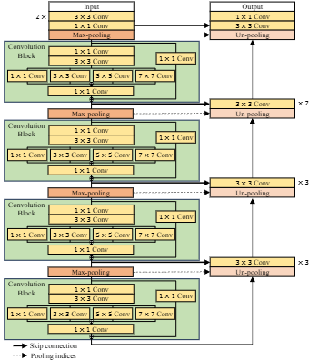

# PyTorch Implementation of MRB-UNet
 
The architecture can be referenced by a manuscript entitled, "Multiple Kernel-Enhanced Encoder for Effective Herbarium Image Segmentation." 

## Overview
This repository contains an official implementation of Herbarim Segmentation Network (HSNet) using PyTorch.<br/>


## Neural Network

## Paper
If you use this software for your research, please cite:

```bibtex
@article{lee2024multiple,
  title={Multiple Kernel-Enhanced Encoder for Effective Herbarium Image Segmentation},
  author={S. Lee, H. Moon, S. Kim, and J. Lee},
  
}
```

## License
This program is available for download for non-commercial use, licensed under the GNU General Public License. This allows its use for research purposes or other free software projects but does not allow its incorporation into any type of commercial software.

## Files
The repository contains the following files:
- `main.ipynb`: Ipynb script file, containing the PyTorch implementation of the MRB-UNet
- `herbarim_segmentation_network.png`: Figure file for network
- `README.md`: Markdown file explaining the model source code


