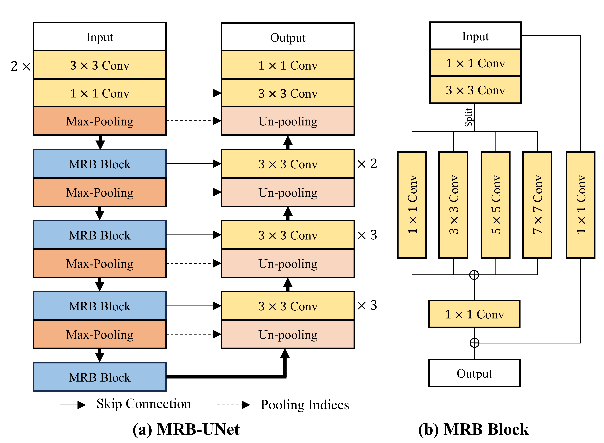

# PyTorch Implementation of MRB-UNet
 
The architecture can be referenced by a manuscript entitled, "Enhancing Encoder with Multiple Kernel Sizes for Herbarium Image Segmentation Network." 

## Overview
This repository contains an official implementation of MRB-UNet using PyTorch.<br/>


## Data preprocessing and Neural Network

## Paper
If you use this software for your research, please cite:

```bibtex
@article{lee2024multihead,
  title={Enhancing Encoder with Multiple Kernel Sizes for Herbarium Image Segmentation Network},
  author={S. Lee, H. Moon, S. Kim, and J. Lee},
  
}
```

## License
This program is available for download for non-commercial use, licensed under the GNU General Public License. This allows its use for research purposes or other free software projects but does not allow its incorporation into any type of commercial software.

## Files
The repository contains the following files:
- `main.py`: Ipynb script file, containing the PyTorch implementation of the MRB-UNet
- `MRB_UNet.png`: Figure file for network
- `README.md`: Markdown file explaining the model source code


